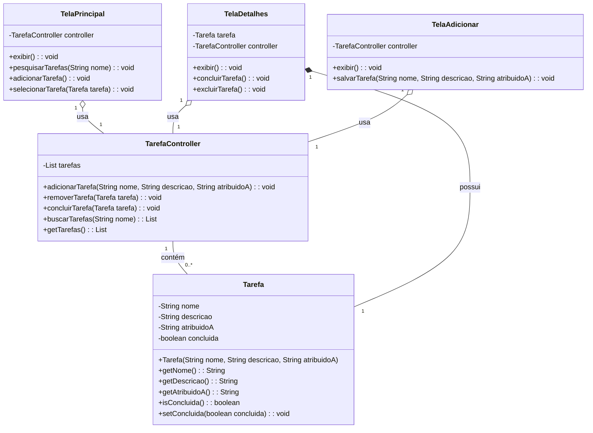

### Diagrama de Classe

```mermaid
classDiagram
    class Tarefa {
        -String nome
        -String descricao
        -String atribuidoA
        -boolean concluida
        +Tarefa(String nome, String descricao, String atribuidoA)
        +getNome(): String
        +getDescricao(): String
        +getAtribuidoA(): String
        +isConcluida(): boolean
        +setConcluida(boolean concluida): void
    }

    class TarefaController {
        -List<Tarefa> tarefas
        +adicionarTarefa(String nome, String descricao, String atribuidoA): void
        +removerTarefa(Tarefa tarefa): void
        +concluirTarefa(Tarefa tarefa): void
        +buscarTarefas(String nome): List<Tarefa>
        +getTarefas(): List<Tarefa>
    }

    class TelaPrincipal {
        -TarefaController controller
        +exibir(): void
        +pesquisarTarefas(String nome): void
        +adicionarTarefa(): void
        +selecionarTarefa(Tarefa tarefa): void
    }

    class TelaDetalhes {
        -Tarefa tarefa
        -TarefaController controller
        +exibir(): void
        +concluirTarefa(): void
        +excluirTarefa(): void
    }

    class TelaAdicionar {
        -TarefaController controller
        +exibir(): void
        +salvarTarefa(String nome, String descricao, String atribuidoA): void
    }

    TarefaController "1" -- "0..*" Tarefa: contém
    TelaPrincipal "1" o-- "1" TarefaController: usa
    TelaDetalhes "1" o-- "1" TarefaController: usa
    TelaDetalhes "1" *-- "1" Tarefa: possui
    TelaAdicionar "1" o-- "1" TarefaController: usa
```